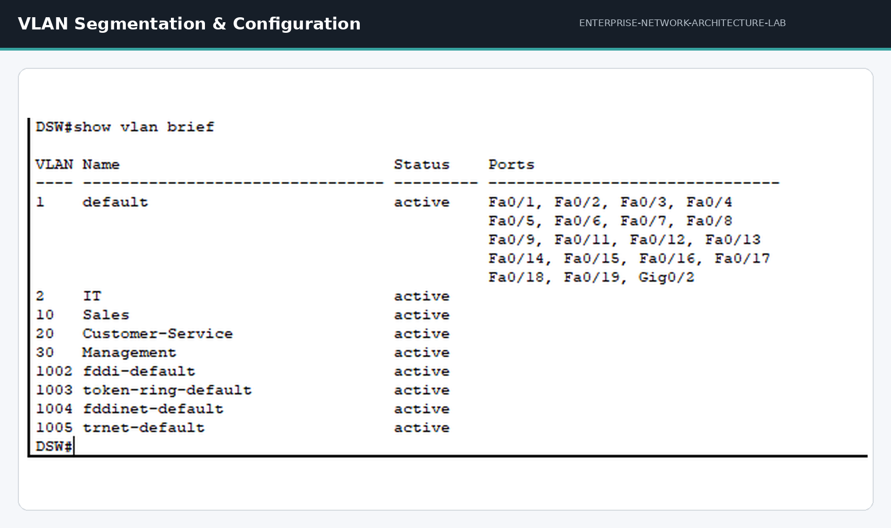
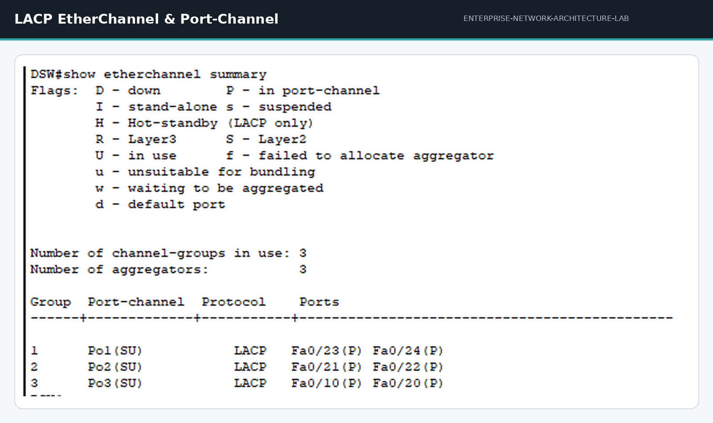
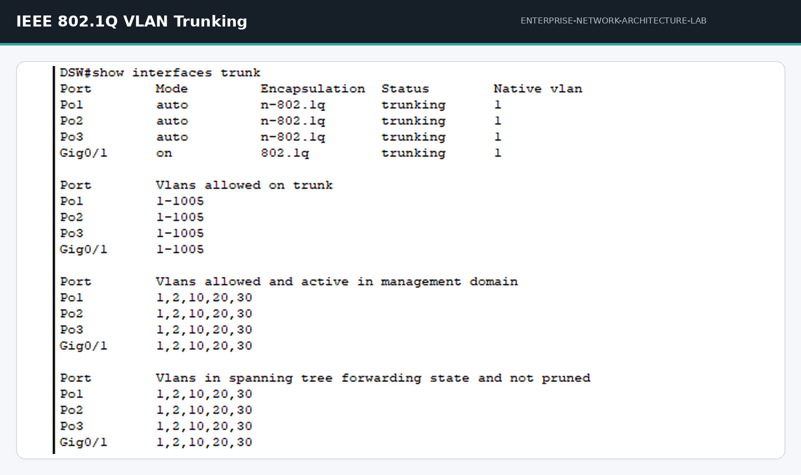
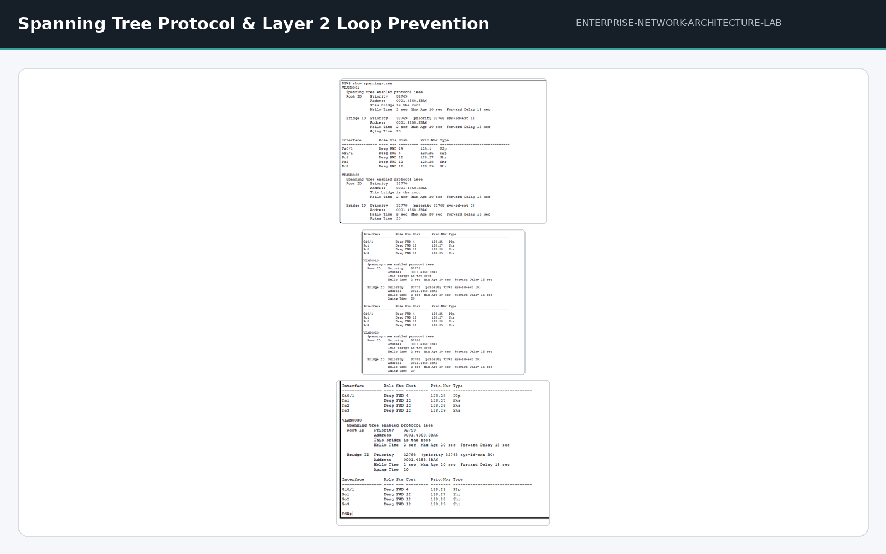
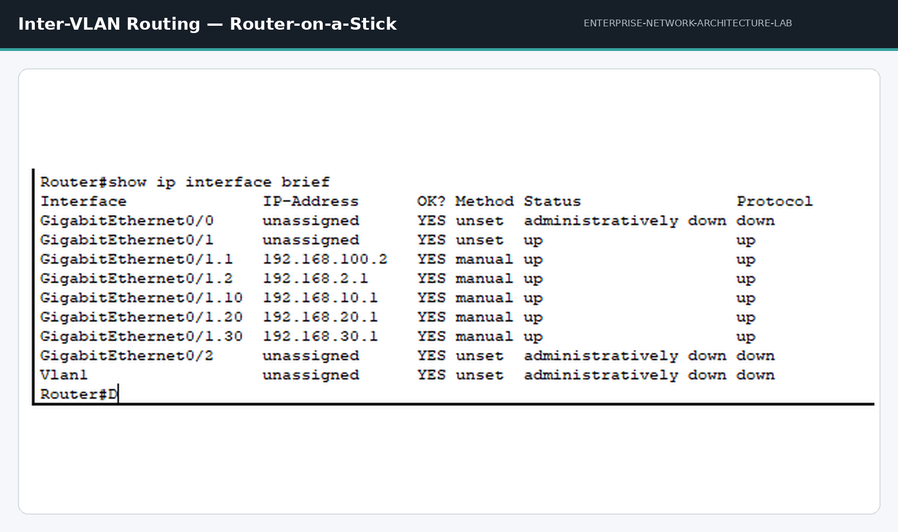
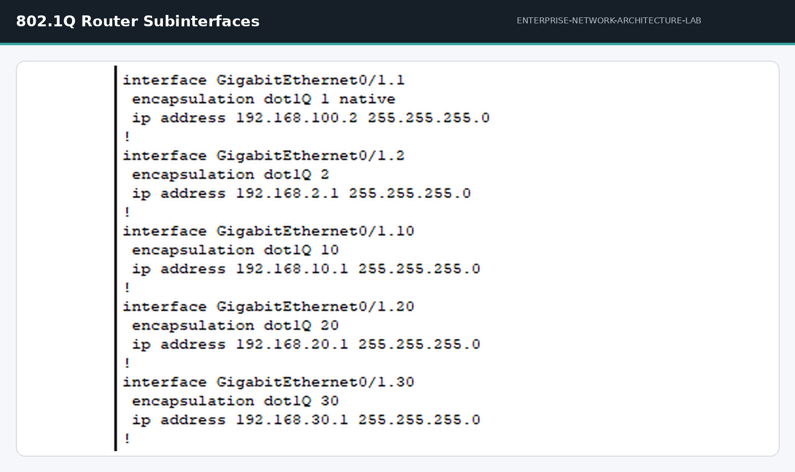
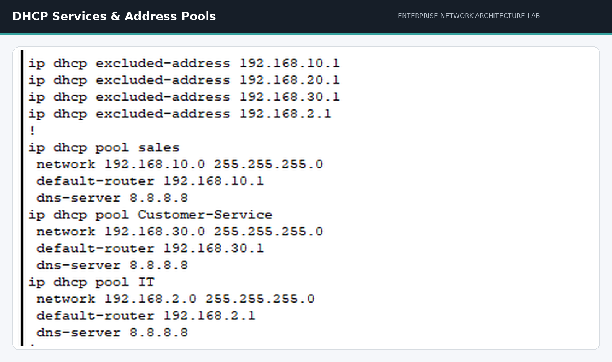

<h1 align="center">🌐 Enterprise Network Architecture Lab</h1>

<strong>Cisco Network Infrastructure & Routing Lab</strong>

Enterprise Cisco network design, configuration, and validation using Cisco Packet Tracer.

---

## 📋 Project Overview

This repository showcases an **enterprise-style Cisco network simulation** built entirely in Cisco Packet Tracer. The lab models a structured, multi-department network infrastructure and demonstrates practical, hands-on implementation of core enterprise networking technologies:

- Layer 2 switching
- VLAN segmentation
- LACP EtherChannel
- IEEE 802.1Q trunking
- Spanning Tree Protocol (STP)
- Router-on-a-Stick inter-VLAN routing
- DHCP services

> [!NOTE]
> This is an **enterprise-style lab**, not a production deployment — every configuration was built and verified within Cisco Packet Tracer.

---

## 🌐 Network Architecture

The topology is centered around a **Distribution Switch (DSW)**, which aggregates uplinks from three departmental access switches and forwards trunked traffic to the router for inter-VLAN routing.

| Device | Role |
|---|---|
| **DSW** | Distribution Switch — central aggregation layer |
| **SW1-Sales** | Access switch for the Sales department |
| **SW2-Customer-Service** | Access switch for the Customer Service department |
| **SW3-Management** | Access switch for the Management department |
| **Router0** | Performs Router-on-a-Stick inter-VLAN routing |
| **Server** | Hosts network services (DHCP) |
| **End Devices** | Departmental PCs distributed across VLANs |

Each departmental switch connects to DSW through a dedicated **LACP EtherChannel** uplink, while the router provides Layer 3 gateway services through **802.1Q subinterfaces**.

---

## 🔵 VLAN Segmentation

VLAN segmentation provides **logical isolation** and **broadcast domain separation** across departments, enabling structured, department-based traffic organization.

| VLAN | Department | Network | Gateway |
|---|---|---|---|
| 2 | IT | 192.168.2.0/24 | 192.168.2.1 |
| 10 | Sales | 192.168.10.0/24 | 192.168.10.1 |
| 20 | Customer Service | 192.168.20.0/24 | 192.168.20.1 |
| 30 | Management | 192.168.30.0/24 | 192.168.30.1 |

By separating each department into its own VLAN and subnet, the design limits broadcast traffic, improves network organization, and establishes clear boundaries for departmental IP addressing.

---

## 🟢 LACP EtherChannel

Three **LACP-based EtherChannel** bundles provide uplink redundancy and increased aggregate bandwidth between each access switch and the Distribution Switch.

| Port-Channel | Protocol | Department | Physical Links |
|---|---|---|---|
| Po1 | LACP | Sales | Fa0/23 + Fa0/24 |
| Po2 | LACP | Customer Service | Fa0/21 + Fa0/22 |
| Po3 | LACP | Management | Fa0/10 + Fa0/20 |

Each Port-Channel combines two physical interfaces into a single logical link through dynamic **LACP negotiation**. This design delivers:

- **Uplink redundancy** — traffic continues to flow if one physical link fails
- **Increased aggregate bandwidth** across the access-to-distribution links
- **Simplified logical topology** through unified Port-Channel interfaces

---

## 🟠 IEEE 802.1Q Trunking

IEEE 802.1Q trunking enables **multi-VLAN traffic transport** across the switching infrastructure using VLAN tagging.

Verified trunk interfaces on **DSW**:

- Po1
- Po2
- Po3
- Gi0/1

**Allowed VLANs on trunk links:** 1, 2, 10, 20, 30

This trunk infrastructure carries tagged traffic from all departmental VLANs across the Distribution Switch, ensuring correct delivery to the router for inter-VLAN routing.

---

## 🔴 Spanning Tree Protocol

Spanning Tree Protocol (STP) provides **Layer 2 loop prevention** across the redundant switch topology.

The **Distribution Switch (DSW)** is configured as the **Root Bridge** for:

- VLAN 1
- VLAN 2
- VLAN 10
- VLAN 20
- VLAN 30

> [!IMPORTANT]
> With DSW acting as the Root Bridge, the network maintains a stable, loop-free Layer 2 topology while preserving redundant physical paths for failover through **redundant path management**.

---

## 🟣 Inter-VLAN Routing

Inter-VLAN routing is implemented using the **Router-on-a-Stick** model. A single physical router interface is divided into multiple **802.1Q subinterfaces**, each serving as the Layer 3 gateway for its corresponding VLAN.

| Subinterface | VLAN | Gateway |
|---|---:|---|
| G0/0.2 | 2 | 192.168.2.1 |
| G0/0.10 | 10 | 192.168.10.1 |
| G0/0.20 | 20 | 192.168.20.1 |
| G0/0.30 | 30 | 192.168.30.1 |

Each subinterface is tagged for its respective VLAN, providing Layer 3 gateway services that enable communication between the IT, Sales, Customer Service, and Management networks.

---

## ⚙️ Router Subinterfaces

The router's physical interface (**G0/0**) is logically subdivided into multiple 802.1Q-tagged subinterfaces, each acting as the default gateway for a specific VLAN.

| Subinterface | IP Address |
|---|---|
| G0/0.1 | 192.168.100.2 |
| G0/0.2 | 192.168.2.1 |
| G0/0.10 | 192.168.10.1 |
| G0/0.20 | 192.168.20.1 |
| G0/0.30 | 192.168.30.1 |

All verified subinterfaces are confirmed operational, providing Layer 3 gateway functionality across the network.

---

## 📡 DHCP Services

DHCP is configured to provide **dynamic IP address assignment** to end devices across the network.

- Address pools are configured per department
- Client devices automatically receive addressing information
- Removes the need for manual IP configuration on end devices
- Supports consistent network addressing automation

---

## 🔍 Network Validation

The network configuration was validated using the following Cisco IOS verification commands:

| Command | Validates |
|---|---|
| `show vlan brief` | VLAN creation and port-to-VLAN assignments |
| `show interfaces trunk` | Trunk status and allowed VLAN list |
| `show etherchannel summary` | Port-Channel status and bundled member interfaces |
| `show etherchannel port-channel` | Detailed LACP Port-Channel information |
| `show spanning-tree` | STP state and Root Bridge election |
| `show ip interface brief` | Subinterface status and IP addressing |
| `show ip route` | Routing table and directly connected networks |

These commands confirmed correct VLAN assignment, trunk operation, EtherChannel bundling, spanning-tree stability, and subinterface routing throughout the topology.

---

## 🧰 Technologies & Networking Concepts

- Cisco IOS
- Cisco Packet Tracer
- VLAN Segmentation
- IEEE 802.1Q
- LACP
- EtherChannel
- Port-Channel
- Spanning Tree Protocol
- Router-on-a-Stick
- Inter-VLAN Routing
- DHCP
- IP Addressing
- Subnetting
- Layer 2 Switching
- Layer 3 Routing
- Network Validation

---

## 🎯 Project Objectives

- Design an enterprise-style Cisco topology
- Implement VLAN segmentation
- Configure IEEE 802.1Q trunking
- Implement LACP EtherChannel
- Configure Spanning Tree Protocol
- Implement Router-on-a-Stick inter-VLAN routing
- Enable inter-VLAN communication
- Configure DHCP services
- Validate Cisco IOS configurations

---

## 📁 Project Files

| File | Description |
|---|---|
| `Enterprise-Network-Architecture-Lab.pkt` | Cisco Packet Tracer project file |
| `01-network-topology(2).png` | Full network topology diagram |
| `02-vlan-segmentation.png` | VLAN configuration and segmentation |
| `03-lacp-etherchannel.png` | LACP EtherChannel configuration |
| `04-8021q-trunking.png` | IEEE 802.1Q trunk configuration |
| `05-inter-vlan-routing.png` | Inter-VLAN routing configuration |
| `06-spanning-tree-protocol.png` | Spanning Tree Protocol verification |
| `06-router-subinterfaces.png` | Router subinterface configuration |
| `07-dhcp-services.png` | DHCP service configuration |

---

<h3 align="center">👨‍💻 Mohannad Mahmoud</h3>

IT Support Engineer & IT Instructor

Networking | Windows Server | Network Security

<a href="https://www.linkedin.com/in/mohanad-mahmoud-it">LinkedIn</a>

